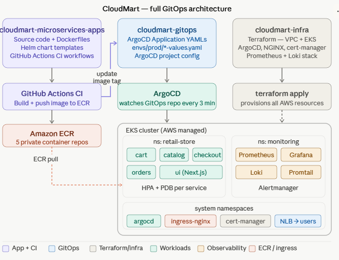
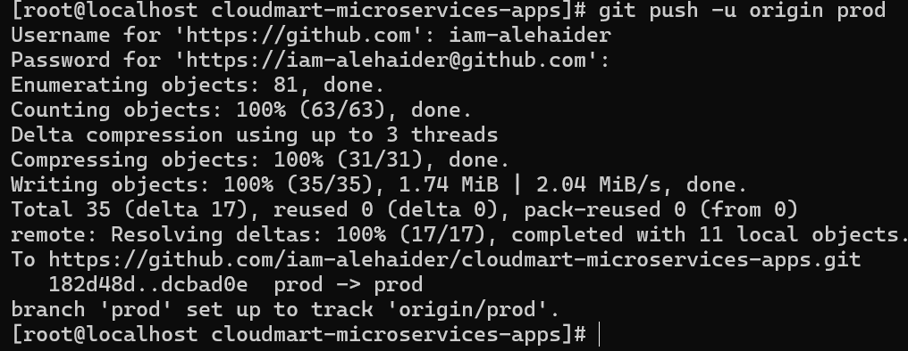

# CloudMart Microservices Apps

[](https://github.com/iam-alehaider/cloudmart-microservices-apps)
[](https://github.com/iam-alehaider/cloudmart-microservices-apps)
[](https://github.com/iam-alehaider/cloudmart-microservices-apps)
[](LICENSE)

Production-grade microservices application for CloudMart — a cloud-native retail platform. This repository contains all service source code, Dockerfiles, Helm chart templates, and GitHub Actions CI pipelines. Each service is built, containerised, and pushed to Amazon ECR independently on every push to the `prod` branch.

---

## Table of Contents

- [Architecture Overview](#architecture-overview)
- [Screenshots & Demo](#screenshots--demo)
- [Repository Structure](#repository-structure)
- [Services](#services)
- [CI/CD Pipeline](#cicd-pipeline)
- [AWS OIDC Authentication](#aws-oidc-authentication)
- [Helm Charts](#helm-charts)
- [Local Development](#local-development)
- [Environment Variables](#environment-variables)
- [Prerequisites](#prerequisites)
- [Contributing](#contributing)

---

## Architecture Overview

CloudMart follows a GitOps deployment model with a clean separation of concerns across three repositories:

| Repository | Responsibility |
|---|---|
| `cloudmart-microservices-apps` | Source code, Dockerfiles, Helm chart templates, CI pipelines |
| `cloudmart-gitops` | ArgoCD Application manifests, per-environment values (image tags) |
| `cloudmart-infra` | Terraform — EKS cluster, VPC, ArgoCD, monitoring stack |

The CI pipeline in **this repo** builds Docker images and pushes them to ECR. It then commits the updated image tag into `cloudmart-gitops`, which triggers ArgoCD to reconcile the cluster state automatically.

---

## Screenshots & Demo

### Full GitOps Architecture

> End-to-end flow: source code push → GitHub Actions CI → ECR → ArgoCD → EKS cluster. Shows all three repos and how they interact.

### Code Push to Prod Branch — CI Triggered

> `git push -u origin prod` pushing 81 objects to GitHub, which triggers the per-service CI workflows automatically.

> **Note:** Upload these images to a `docs/screenshots/` folder in this repository to display them here.

---

## Repository Structure

```
cloudmart-microservices-apps/
└── src/
    ├── cart/
    │   ├── chart/
    │   │   ├── Chart.yaml
    │   │   ├── values.yaml          # Default chart values (never modified by CI)
    │   │   └── templates/
    │   │       ├── deployment.yaml
    │   │       ├── service.yaml
    │   │       ├── configmap.yaml
    │   │       ├── hpa.yaml
    │   │       ├── pdb.yaml
    │   │       ├── serviceaccount.yaml
    │   │       ├── dynamodb-deployment.yaml
    │   │       └── dynamodb-service.yaml
    │   ├── src/                     # Java/Spring Boot source
    │   ├── Dockerfile
    │   └── pom.xml
    ├── catalog/
    ├── checkout/
    ├── orders/
    └── ui/
```

> **Golden Rule:** CI modifies image tags **only** in `cloudmart-gitops/envs/prod/*.yaml`. The `values.yaml` files in this repo are never touched by automation.

---

## Services

| Service | Language / Framework | Port | ECR Repository |
|---|---|---|---|
| **Cart** | Java / Spring Boot | 8080 | `demo-private/cart` |
| **Catalog** | Go | 8080 | `demo-private/catalog` |
| **Checkout** | Node.js | 8080 | `demo-private/checkout` |
| **Orders** | Java / Spring Boot | 8080 | `demo-private/orders` |
| **UI** | Node.js / Next.js | 8080 | `demo-private/ui` |

Each service is independently deployable. Services communicate via internal Kubernetes DNS (`<service>.retail-store.svc.cluster.local`).

---

## CI/CD Pipeline

### How It Works

Each service has its own GitHub Actions workflow file (`.github/workflows/<service>-ci.yml`). A workflow triggers **only** when files inside `src/<service>/` are modified — preventing unnecessary rebuilds of unrelated services.

```
Developer pushes to prod branch
        │
        ▼
GitHub Actions (per-service workflow)
        │
        ├── Authenticate to AWS (OIDC — no stored keys)
        ├── Build Docker image
        ├── Tag image with Git commit SHA
        ├── Push image to Amazon ECR
        │
        └── Checkout cloudmart-gitops repo
                │
                └── Update envs/prod/<service>-values.yaml
                        └── Commit & push → triggers ArgoCD sync
```

### Workflow Trigger Example (Cart)

```yaml
on:
  push:
    branches: [prod]
    paths:
      - 'src/cart/**'
```

### Image Tagging Strategy

Images are tagged with the Git short commit SHA (e.g., `a1b2c3d`), creating an immutable, traceable tag per build. The `latest` tag is never used in production.

### GitOps Update Step

After a successful ECR push, the workflow uses `yq` to update the image tag in the GitOps repository:

```yaml
- name: Update image tag in GitOps repo
  run: |
    yq -i '.image.tag = env(IMAGE_TAG)' gitops/envs/prod/cart-values.yaml
```

---

## AWS OIDC Authentication

This repository uses **AWS OpenID Connect (OIDC)** to authenticate GitHub Actions to AWS — no AWS access keys are stored anywhere.

### How It Works

1. GitHub Actions requests a short-lived OIDC token at runtime.
2. AWS STS validates the token against the registered identity provider.
3. The IAM role (`github-actions-ecr-role`) is assumed with temporary credentials.
4. Docker images are pushed to ECR with those temporary credentials.

### IAM Role Trust Policy

The trust policy is scoped to **this specific repository and branch only**:

```json
{
  "Version": "2012-10-17",
  "Statement": [
    {
      "Effect": "Allow",
      "Principal": {
        "Federated": "arn:aws:iam::<ACCOUNT_ID>:oidc-provider/token.actions.githubusercontent.com"
      },
      "Action": "sts:AssumeRoleWithWebIdentity",
      "Condition": {
        "StringEquals": {
          "token.actions.githubusercontent.com:aud": "sts.amazonaws.com"
        },
        "StringLike": {
          "token.actions.githubusercontent.com:sub": "repo:iam-alehaider/cloudmart-microservices-apps:ref:refs/heads/prod"
        }
      }
    }
  ]
}
```

| Feature | OIDC | Static Access Keys |
|---|---|---|
| Stored in GitHub Secrets | No | Yes |
| Auto-expiring credentials | Yes | No |
| Branch-scoped | Yes | No |
| Safe for public repos | Yes | Never |

### Required Workflow Permissions

```yaml
permissions:
  id-token: write    # Required to request the OIDC token
  contents: write    # Required to push updated image tags to GitOps repo
```

---

## Helm Charts

Helm chart templates live alongside their service code in `src/<service>/chart/`. This approach keeps the deployment manifest version-locked to the application code.

### Chart Structure

```
chart/
├── Chart.yaml          # Chart metadata and version
├── values.yaml         # Default values (image repo, replica count, resource limits)
└── templates/
    ├── deployment.yaml
    ├── service.yaml
    ├── configmap.yaml
    ├── hpa.yaml          # Horizontal Pod Autoscaler
    ├── pdb.yaml          # Pod Disruption Budget
    └── serviceaccount.yaml
```

### Key Design Decision

- **Templates** are sourced from this repo (versioned with application code).
- **Values** (including image tags) are sourced from `cloudmart-gitops/envs/prod/`.
- ArgoCD's multi-source Application feature joins these two sources at deploy time.

---

## Local Development

### Prerequisites

- Docker 24+
- Helm 3.x
- kubectl 1.29+
- AWS CLI v2 (for ECR access)

### Run a Service Locally

```bash
# Build and run the cart service
cd src/cart
docker build -t cloudmart-cart:local .
docker run -p 8080:8080 cloudmart-cart:local
```

### Lint Helm Charts

```bash
helm lint src/cart/chart
helm template test src/cart/chart --values src/cart/chart/values.yaml
```

---

## Environment Variables

| Variable | Description | Set In |
|---|---|---|
| `GITOPS_PAT` | GitHub PAT with `repo` + `workflow` scopes | GitHub Repository Secret |
| `AWS_REGION` | AWS region for ECR (e.g., `us-west-2`) | Workflow env block |
| `ECR_REPOSITORY` | ECR repo name (e.g., `demo-private/cart`) | Workflow env block |

---

## Prerequisites

| Tool | Version | Purpose |
|---|---|---|
| AWS CLI | v2 | ECR authentication |
| Docker | 24+ | Image build |
| Helm | 3.x | Chart linting |
| kubectl | 1.29+ | Local cluster testing |
| yq | latest | GitOps YAML updates |

---

## Contributing

1. Create a feature branch from `prod`.
2. Make changes inside `src/<service>/`.
3. Ensure `helm lint` and Docker build pass locally.
4. Open a pull request against `prod`.
5. Merge triggers the CI pipeline automatically.

> Only changes in `src/<service>/` trigger that service's CI workflow — you can safely update chart templates or documentation without triggering image rebuilds.

---

**Related Repositories**

- [cloudmart-gitops](https://github.com/iam-alehaider/cloudmart-gitops) — ArgoCD Application manifests and environment-specific values
- [cloudmart-infra](https://github.com/iam-alehaider/cloudmart-infra) — Terraform infrastructure (EKS, VPC, ArgoCD, monitoring)
